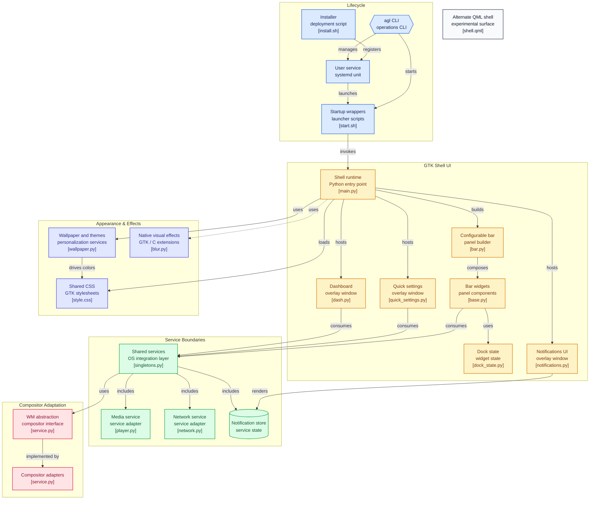

*agility shell is a modern, GTK-based desktop shell built on top of caffyne-shell based on Fabric, Python, and GTK. It features a highly customizable drag-and-drop panel, fluid animations, and deeply integrated system applets designed specifically for modern Wayland compositors.*

---

## Features

* **Modern UI Architecture:** Built with native GTK widgets running smoothly on Wayland.
* **Dynamic Personalization:** Powered by *Matugen* to deliver seamless *Material You* color palettes derived dynamically from your wallpapers.
* **Interactive Control Hub:** 15 pre-built applets covering everything from process management to a quick settings panel.
* **Modular Bar Design:** A highly flexible, drag-and-drop bar structure optimized for flexibility.

---

## Supported Window Managers

While agility shell does not manage window configurations itself, it connects natively to the following Wayland compositors:

| Window Manager | Status |
| -------------- | ------ |
| **Niri**       | Stable |
| **Hyprland**   | Beta   |
| **MangoWM**    | Beta   |

---

## Installation & Quick Start

### 1. Check & Install Dependencies (Step-by-Step Doctor)
To test and install every missing dependency one-by-one with interactive prompts:

```bash
curl -fsSL https://raw.githubusercontent.com/TattvaOrg/agility-shell/main/install.sh | bash -s -- --deps
```

### 2. Install Agility Shell (System-Wide)
Once dependencies are satisfied, install Agility Shell into the distributed system directories (`/usr/share` and `/usr/lib`):

```bash
curl -fsSL https://raw.githubusercontent.com/TattvaOrg/agility-shell/main/install.sh | bash
```

>[!NOTE]
>The installer automatically scans `~/.config/agility-shell` for any old monolithic shell installations, removes old source files and venvs, and safely migrates your custom configs, themes, wallpapers, and styles to the new clean config directory.

### 3. Update Agility Shell (One-Liner Delta Update)
To update Agility Shell without re-cloning the entire repository:

```bash
curl -fsSL https://raw.githubusercontent.com/TattvaOrg/agility-shell/main/update.sh | bash
```

> **Channel Selection**: The updater interactively asks whether to update to the **Latest Release** (stable tag) or the bleeding-edge **`main` branch**. It reuses the persistent local repository cache (`~/.cache/agility-shell/repo`), downloads only new commits/deltas instead of full re-clones, compiles updated snippets, and preserves all user configurations (`config.json`, `suits.json`, `style/`, `wallpapers/`).
>
> **Direct Channel Flags**:
> - Update to Latest Release: `curl -fsSL https://raw.githubusercontent.com/TattvaOrg/agility-shell/main/update.sh | bash -s -- --release`
> - Update to Bleeding-Edge Main: `curl -fsSL https://raw.githubusercontent.com/TattvaOrg/agility-shell/main/update.sh | bash -s -- --main`
> - Or directly from terminal: `agl update`

---

## Filesystem Layout & Architecture ("Where & Why")

Agility Shell follows standard Linux Filesystem Hierarchy Standards (FHS) and XDG base directory specifications to keep application code, dependencies, user data, and runtime logs cleanly decoupled.

| Location | Component | Purpose & Why It Lives Here |
| :--- | :--- | :--- |
| **`/usr/bin/`** or **`~/.local/bin/`** | `agl`<br>`agility-shell` | **Executables & CLI**: Accessible directly from your `$PATH`. `agility-shell` auto-detects its environment (repo checkout vs system install) and launches the shell, while `agl` manages services, configs, and updates. |
| **`/usr/share/agility-shell/`** | Core Application Source & Assets | **Immutable Code & Assets**: Contains `main.py`, `bar.py`, applets, widgets, sounds, SVGs, and baseline stylesheets. Placed here so system updates can upgrade the shell code without touching your personal preferences. |
| **`/usr/lib/agility-shell/`** | Virtualenv & Native Shared Objects | **Isolated Runtime**: Houses `/usr/lib/agility-shell/venv` (Python runtime with Fabric) and compiled C shared libraries (`libblur.so`, `libhacktk.so`). Prevents Python package conflicts with system packages while still binding to native Wayland layer-shell libraries. |
| **`~/.config/agility-shell/`** | User Configuration & Customizations | **Personal Settings**: Stores `config.json` (bar layout, widget ordering), `suits.json` (desktop presets), `style/*.css` (Matugen colors, custom borders), `wallpapers/`, and `config/niri.kdl`. Never overwritten by updates. |
| **`~/.config/systemd/user/`** | `agility-shell.service` | **Process Lifecycle & Autostart**: Systemd user unit tied to `graphical-session.target`. Provides automatic login startup, automatic crash recovery (`Restart=on-failure`), and unified log management. |
| **`~/.cache/agility-shell/`** | `shell.log` & Image Caches | **Ephemeral State & Logs**: Stores live session logs (`shell.log`), blurred wallpaper buffers, and temporary thumbnails. Keeps user config uncluttered and allows easy debugging. |

### Why This Separation Matters:
1. **Clean Updates**: Upgrading Agility Shell replaces only `/usr/share/` and `/usr/lib/`; your personal themes, suits, and bar layouts in `~/.config/agility-shell` remain untouched.
2. **Crash Resilience**: Systemd service management guarantees that if the compositor reloads or an applet hiccups, Agility Shell restarts automatically in the background.
3. **Multi-Environment Support**: The launcher automatically favors a local development checkout if run from a git clone, or falls back to system files when executed via systemd or CLI.

---

## CLI Management (`agl`)

Agility Shell includes a dedicated command-line interface `agl` installed to `/usr/bin/agl` (or `~/.local/bin/agl`) for easy lifecycle and maintenance management:

```bash
agl <command> [options]
```

| Command | Description | Example |
| :--- | :--- | :--- |
| `agl start` | Launch Agility Shell (or systemd user unit) | `agl start` |
| `agl restart` | Restart running shell gracefully | `agl restart` (or `agl restart -f` for live logs) |
| `agl status` | Check runtime process and service status | `agl status` |
| `agl deps` | Test and install dependencies step-by-step | `agl deps` |
| `agl update` | Update shell in-place while preserving wallpapers & configs | `agl update` |
| `agl uninstall` | Cleanly uninstall Agility Shell | `agl uninstall` (or `agl uninstall --purge`) |
| `agl install` | Run or rerun system installer | `agl install` |
| `agl suits` | Manage desktop suites (switch, list, next, prev) | `agl suits next` |
| `agl bar` | Adjust bar thickness dynamically (`agl bar height <26-48>`) | `agl bar height 36` |

---

## Maintenance Scripts (`scripts/`)

All lifecycle scripts are organized inside the `scripts/` directory, with root wrappers maintained as backup forwarders for 100% backward compatibility:

| Script | Location | Purpose |
| :--- | :--- | :--- |
| `install.sh` | `scripts/install.sh` | Full system dependency check, venv setup, snippet compilation, and `agl` CLI linking |
| `update.sh` | `scripts/update.sh` | In-place updater preserving user configs and wallpapers |
| `uninstall.sh` | `scripts/uninstall.sh` | Process termination, CLI cleanup, and configurable config removal |
| `start.sh` | `scripts/start.sh` | Activates virtualenv and executes `main.py` |
| `restart.sh` | `scripts/restart.sh` | Cleanly kills existing instances and relaunches in background or foreground |

Root backup scripts (`install.sh`, `update.sh`, `uninstall.sh`, `start.sh`, `restart.sh`) act as transparent forwarders to `scripts/*.sh` so automated curl commands and custom scripts continue working seamlessly.

---

## Configuration & Autostart

Agility Shell can be managed via the systemd user service (recommended) or started directly by your Wayland compositor:

### 1. Systemd User Service (Recommended)
Agility Shell automatically enables its user service upon installation:
```bash
systemctl --user enable --now agility-shell.service
```

### 2. Compositor Integration (Guarded Fallback)
To ensure the shell is running while avoiding duplicate instances if systemd is already active, use the guarded launcher command:

#### Niri (`config.kdl`)
```kdl
include "~/.config/agility-shell/config/niri.kdl"
# Or standalone:
spawn-at-startup "bash" "-c" "systemctl --user is-active --quiet agility-shell.service || exec agility-shell"
```

#### Hyprland (`hyprland.conf`)
```ini
exec-once = systemctl --user is-active --quiet agility-shell.service || agility-shell
```

#### Modern Lua Config (`hyprland.lua`)
```lua
-- Add this to your exec or startup table
hyprland.exec_once({ "systemctl --user is-active --quiet agility-shell.service || agility-shell" })
```

---

## Controlling Applets (IPC Syntax)

agility shell delegates keyboard shortcut assignments to your host window manager. You can toggle applets smoothly via an Inter-Process Communication (IPC) layer using `fabric-cli`:

```ini
# Example: Niri keybindings to toggle widgets
Mod+Space { spawn "fabric-cli" "exec" "agility-shell" "bar_manager.toggle('Launcher')"; }
Mod+N     { spawn "fabric-cli" "exec" "agility-shell" "bar_manager.toggle('Notifications')"; }
```



---

## Contributing & Credits

Contributions are always welcome! Please check the issues tab, follow our descriptive branching workflow, and submit a pull request.

Special thanks to [caffyne-shell](https://github.com/caffyne-org/caffyne-shell) , `@its-darsh` (Fabric framework), `@Axenide` (backend clients), `@linkfrg` (Ignis runtime inspiration), and `@amansxcalibur` (UI code snippets) for making this project possible.
